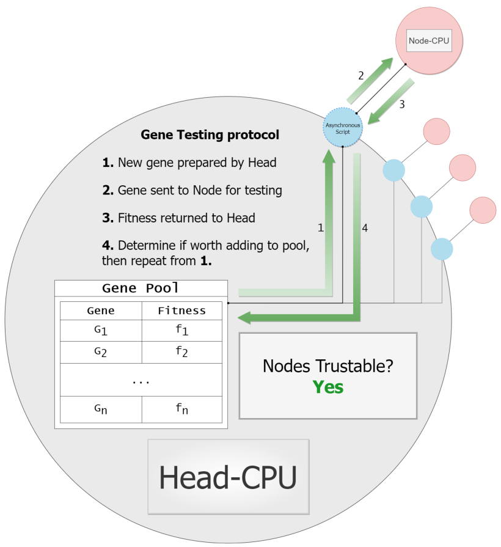

# Installation
1. Clone repository
2. Install packages in ```requirements.txt``` using ```pip install -r requirements.txt```

# How to run example
For an example script, see Example.py

1. Choose a name for your run (```run_name```), and create a simple directory tree. (```logs``` and ```pool``` are folders). All outputs from the genetic alg. run will be contained in ```run_name```:
```
├── run_name
│   ├── logs
│   └── pool
```
2. Next to ```run_name``` create and name the python file that will represent your genetic algorithm and fitness-evaluation code. Add imports for ```Client```, ```Algorithm```, and ```Server``` objects from respective python files:
```python
from Algorithm import Algorithm
from Client import Client
from Server import Server
```
3. Create your own client and algorithm scripts by inheriting Client and Algorithm
4. Below these classes, create an ```if __name__ == '__main__':``` with a single line that creates a Server object. The arguments will give the Algorithm and Client you wrote to the Server:
* ```algorithm_path (str)``` = name of the python file containing your Algorithm class
* ```algorithm_name (str)``` = name you gave your Algorithm class
* ```client_path (str)``` = name of the python file containing your Client class
* ```client_name (str)``` = name you gave your Client class
* ```num_clients (int)``` = # of genes being tested in parallel
* ```gene_shape (tuple)``` = shape of genes
* ```num_genes (int)``` = max # of genes stored in gene pool 
```python
if __name__ == '__main__':
  Server(run_name="test_dir", 
		 algorithm_path="Example", algorithm_name="Simple_GA",
		 client_path="Example", client_name="Simple_GA_Client",
		 num_clients=5, gene_shape=(10,), num_genes=10,arguments
		 mutation_rate=0.1, iterations=20)
```
5. Run the file. This should start the genetic algorithm.

# How to write Genetic Algorithms scripts
Writing genetic algorithms for this library will be slightly different than how you may normally write them. There are two important details: 
1. When your code will be executed 
2. How your code will be executed

When: Your code will be executed according to this flow of events. After initialization 


# How to write Client scripts

# Server.py and Server description

