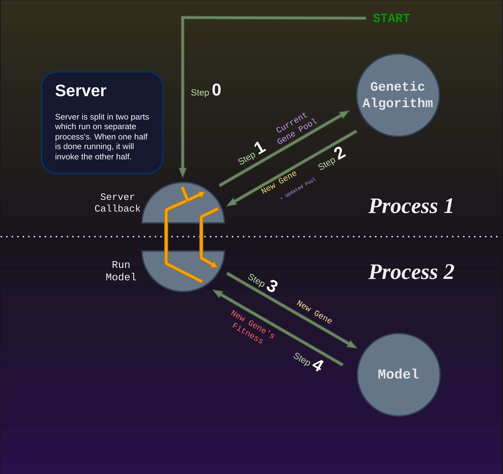

# Abstract Implementation of Server:
This diagram gives an abstract overview of what data is passed between Server and Model/Genetic-Algorithm, and how consistency is maintained with the asynchronous processes.


### Step 0: 
> From a starting file, a Server object is initialized by specifying a Model to train and a Genetic Algorithm to optimize it. From here, the Server will begin the run by initializing the gene pool 

### Step 1:  
> The Server passes a copy of the current gene pool to the genetic algorithm for evaluation, and expects to be returned a new gene. Given the state of the gene pool, the Genetic Algorithm applies logic to prune weak genes and generate a new ones.
The algorithm will make direct changes to its given copy of the gene pool.

### Step 2: 
> After the algorithm has finished manipulating the pool, a New Gene should be generated and returned, along with the Updated Gene Pool. New Gene should already be in the Updated Pool, but the name is needed for the Server to identify which gene was just made. From here, the Server updates the file system with the changes made by the algorithm. This is mainly updating the gene pool, but is also for updating algorithm state variables (like the current iteration). You can find the algorithm state variable file in your runs, they are always named 'RUN_STATUS.json'.

### Step 3: 
> **At this stage, a subprocess on another CPU/core is called to test the New Gene**. This will run in parallel to other subprocess’s running different genes on the same Model. The Model will return a fitness after testing, but note that there is no synchronization step here. The Server will not wait on any subprocess before assigning another subprocess a new gene. 

### Step 4: 
> One the fitness is recieed, the file system gene pool is updated with the New Gene Fitness. This new gene pool is then sent back to the Genetic Algorithm for adjustment, and the process repeats.


This goes until the Genetic Algorithm breaks when an end condition is met. An example for an end condition is setting a maximum number of genes to be tested (for Genetic_Algorithm, this is the ‘iterations’ arg). 

#### Other functions + How to manipulate Gene Pool & Genes

To see some examples of Gene Pool & Gene usage, check the functions ```select_parents()```, ```crossover()```, and ```mutate()``` from the ```Genetic_Algorithm``` class. Note that all of these functions are used to create the New Gene, and are called from the ```create_new_gene()``` function. The following will describe briefly how they do it.

The Gene Pool is simply a dictionary of 'gene_data'. These 'gene_data' are also dictionaries which follow this format:

```Python
gene_data = {'gene': gene_obj,
             'fitness': None,					# Initialized to None, untested
             'test_state': 'being tested',
             'iteration': self.current_iter}	# Marker for when gene was made
```

```gene_obj``` can be either a single np.ndarray or a dict of np.ndarray's, like this:

```Python
# Just one np.ndarray
gene_obj = {
  'gene': some_np_array,
  'fitness': None,					
  'test_state': 'being tested',
  'iteration': self.current_iter
}

# With a dict (better for organizing complex params)
gene_obj = {
  'gene': {
    'L1' : some_np_array0,
    'L2' : some_np_array1,
    ...},
  'fitness': None,					
  'test_state': 'being tested',
  'iteration': self.current_iter
}
```

Recall the Gene Pool is a dictionary filled with the gene's from above. The pool itself can be accessed via two class variables: 
* ```self.pool``` : contains all genes currently in the pool
* ```self.valid_parents``` : contains *only* genes that have a fitness (ie. have been tested by a Model). This version of the pool is for generating new genes, as you don't want to consider genes for reproduction if they haven't been tested yet.

### Server:
Abstractly, the Servers job is to handle asynchronous requests from both the Genetic Algorithm and Model’s, and update the state of the run accordingly. Implementation, however, is not as straight-forward. Most Cluster OS’s like SLURM don’t allow users to run a server in the background to manage nodes, so we need a way to run a ‘server’ that can’t be perpetually-online. To mimic perpetually-online behavior, the Server.py script automatically saves the state of the run to the disk after processing a request, and then exits. When a new request to the Server is made, Server.py will restart and pick up where it left off by reloading the state. I’ll describe how this is done below.

First, there are three types of requests: 
1. ```init```: Indicates a run is being initialized
2. ```server-callback```:  Handles when a subprocess returns a fitness
3. ```run-model```: When the genetic algorithm returns a new gene to test

For reference to the above abstract diagram, an “init” request is used for step 0, a run-model is used for step 2 (requesting a new subprocess to test New Gene), and server-callback for step 3 (calling back to return New Gene's Fitness).

When a request is made, it will call the ‘main’ function at the bottom of Server.py. This is where the previous run state is loaded and prepared for the Server object. To start the Server, the Server object is initialized, and the constructor (\_\_init__()) passes the request through an if-statement which determines how to handle each of the three request types. You can find each request type has a designated class function with the same name that process’s that type.

The following is a shrunken/simplified code snippet from the Server \_\_init__() function:

```Python
def __init__(run_arguments):
	
	# Switch for handling init, model, or server_callback requests
	if call_type == "init":

		# Initialize run
		self.init(run_arguments)

	elif call_type == "run_model":

		# Test gene
		self.run_model(run_arguments)

	elif call_type == "server_callback":
		
		# Return tested fitness
		self.server_callback(run_arguments)

	else:
		raise Exception(f"error, improper call_type: {call_type}")

```

**To recap:** the Server script is started and exits on every request from the Genetic Algorithm and Model. This is handled by storing the state of the run on the disk after each request, and using file locks for synchronization. The script initializes the Server object which then processes the request.

### Process Organization
The following diagram shows how different parts of the script are run on different process’s: 



The orange arrows show how the server processes requests in a cycle, where the Run Model and Server Callback requests will literally call each other after finishing. Presented like this, the whole model doesn't reflect a server/client model anymore, *but* presenting it that way simplifies the concept for general audiences who only care about training their models! There's little value in revealing the complex nature of the back-end when it only serves to confuse an end-user.

For the sake of understanding the code, it may be easier to consider the server as a bridge between the two halves of the DGA algorithm (the Genetic Algorithm and Model). As mentioned, each half will save the state of the run to the files, and call the other half to pick back up again. Calling the other half requires starting a new parallel process. Note that after this new process is made, the parent process will end (code will finish executing and exit). 

Hopefully from this diagram you can see how the behavior of a perpetually running server can be replicated with self-calling scripts and state saving.

Here is the shortened/simplified code representation taken from the Server object. This should help link what you see in the diagram to the code. Take note of the self.make_call() function which generates each of the new requests:

```Python
def init(self, algorithm_type: type, algorithm_args: dict, **kwargs):
  # Make directories
  ...

  # Create run status file
  write_run_status(self.run_name, algorithm_args)

  ############# Orange arrow from step 0 to step 1 #############
  # Generate initial genes                 
  alg = algorithm_type(run_name=self.run_name, **algorithm_args)
  init_genes = []
  for i in range(self.num_parallel_processes):
    init_genes.append(alg.fetch_params())

    # Update pool & status
  self.update_pool(original_pool, final_pool)
  self.update_run_status(alg, algorithm_args.keys())

  ############# Orange arrow from step 2 to step 3 #############
  # Call models to run initial genes
  for i, gene_name in enumerate(init_genes):
    self.make_call(model_id=i, gene_name, "run_model", **kwargs)


def run_model(self, model_type: type, **kwargs):
  model = model_type(**self.model_args)  # Initialize model
  gene_data = load_gene_file(self.run_name, gene_name)  # Gene data from GA

  # Load any training data
  data_lock_path = file_path(self.run_name, POOL_LOCK_NAME)
  with portalocker.Lock(...) as _:
    model.load_data()

  # Test gene & return fitness (by writing to original gene file)
  fitness = model.run(gene_data['gene'], **kwargs)
  with portalocker.Lock(...) as _: 2

  ############# Orange arrow from step 4 to step 1 #############
  # Callback server
  self.make_call(call_type="server_callback", **kwargs)


def server_callback(self, algorithm_type: type, **kwargs):
  # Lock pool files during gene creation to prevent race condition
  with portalocker.Lock(...) as _:

    alg = algorithm_type(...)  # Initialize algorithm
    if alg.end_condition():  # Check if run is complete
      sys.exit()
    gene_name, success = alg.fetch_params()  # Prune pool & generate next gene for testing

    # Update status & break if fetch was success, otherwise try again
    if success:

      self.update_pool()  # Update pool files (pool modified by alg)
      self.update_run_status(...)  # Update run status
      break
    else:
      time.sleep(1)

  ############# Orange arrow from step 2 to step 3 #############
  # Send new gene to model
  self.make_call(call_type="run_model", gene_name=gene_name)
```
